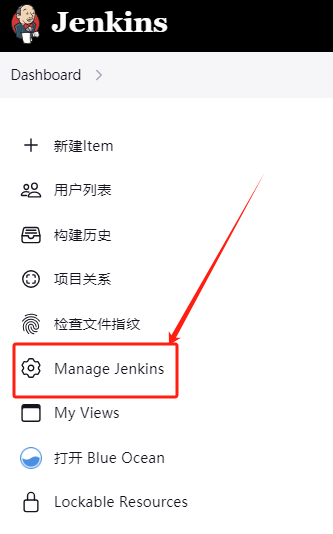
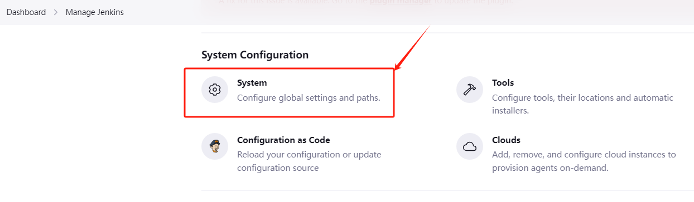
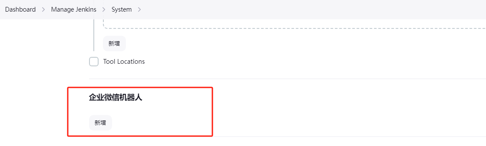
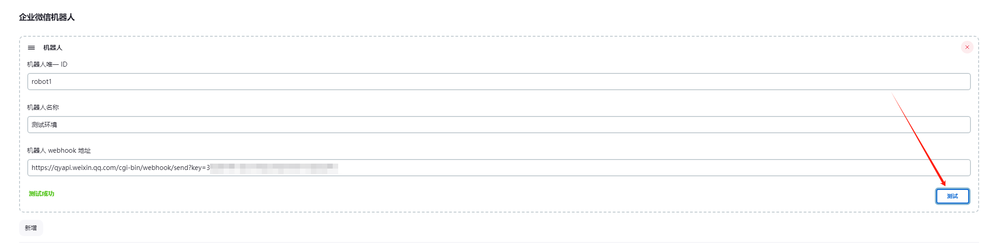
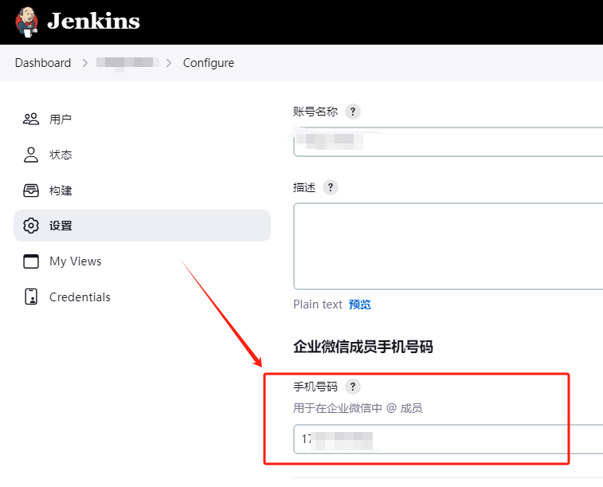
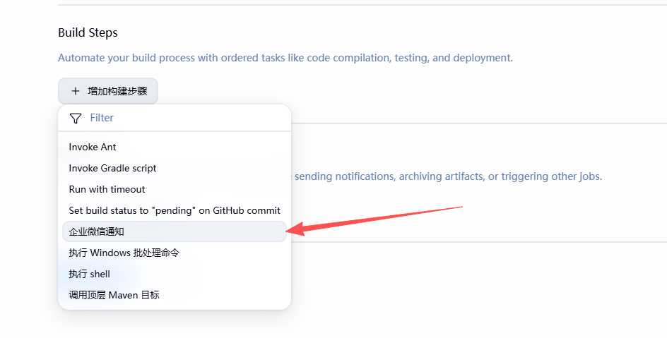
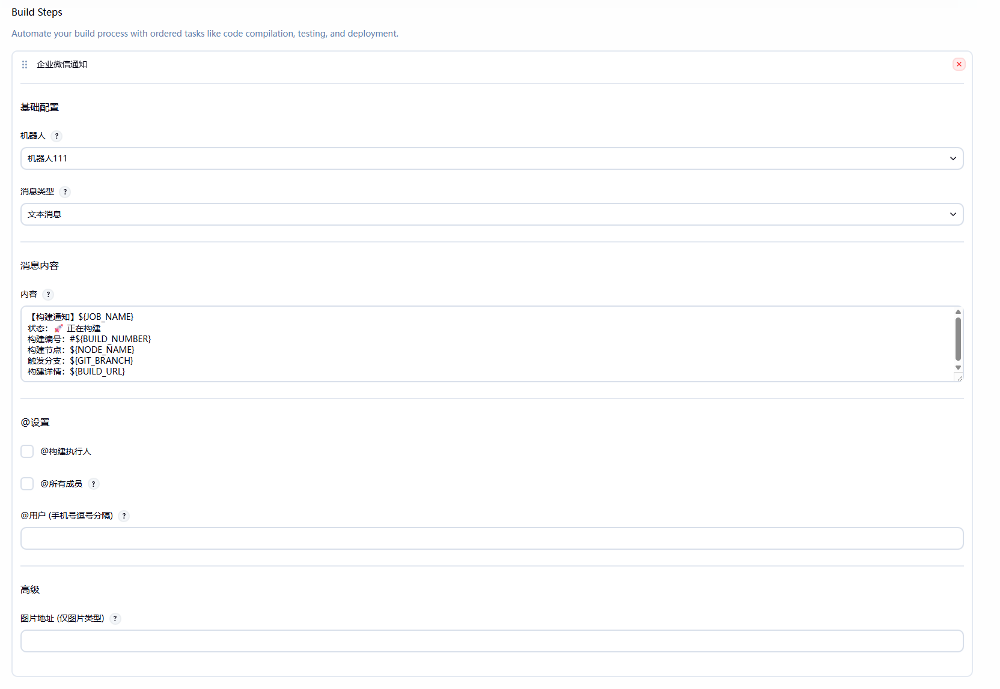
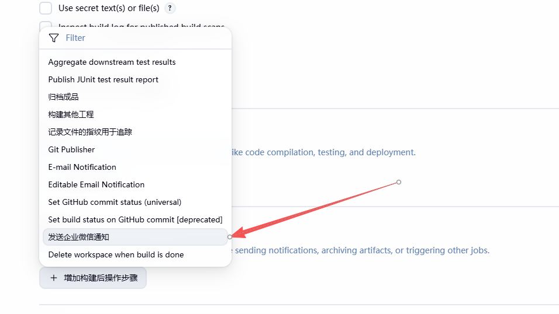
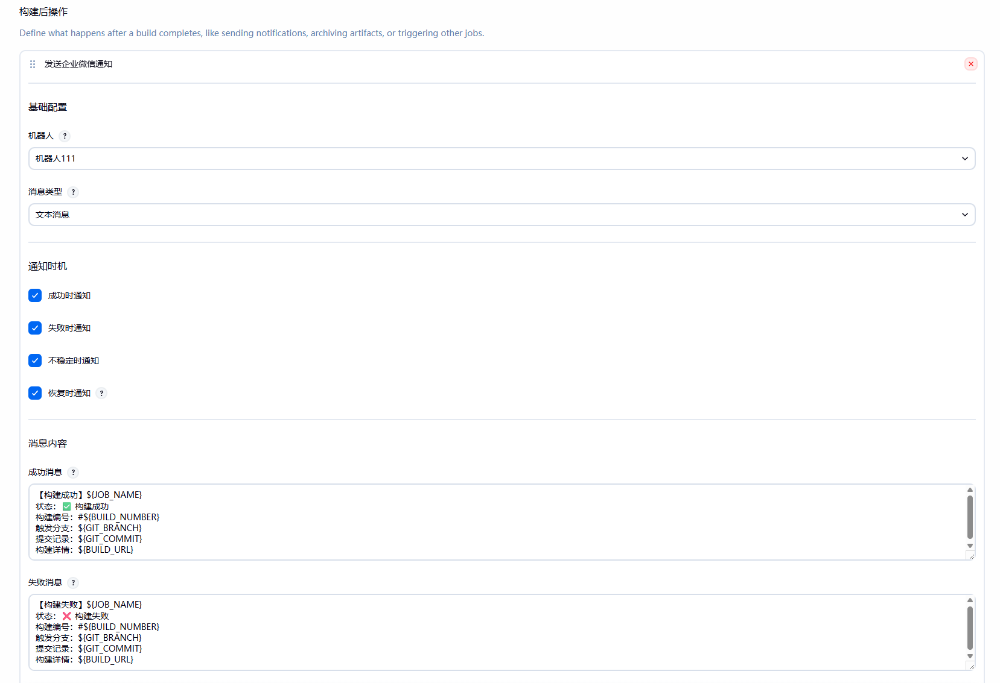

# 企业微信机器人通知插件 (WXWork Notification Plugin)

<p align="center">
  <a href="https://plugins.jenkins.io/wxwork-notification/">
    
  </a>
  <a href="LICENSE">
    
  </a>
  
  
</p>

<p align="center">
  <strong>在 Jenkins Pipeline 和 FreeStyle 项目中轻松发送企业微信机器人消息</strong>
</p>

<p align="center">
  <a href="#功能特性">功能特性</a> •
  <a href="#安装">安装</a> •
  <a href="#前置配置">前置配置</a> •
  <a href="#freestyle-项目">FreeStyle 项目</a> •
  <a href="#pipeline-项目">Pipeline 项目</a> •
  <a href="#常见问题">常见问题</a>
</p>

---

## 📋 目录

- [功能特性](#功能特性)
- [安装](#安装)
- [前置配置](#前置配置)
  - [配置企业微信机器人](#1-配置企业微信机器人)
  - [配置用户手机号（可选）](#2-配置用户手机号可选)
- [FreeStyle 项目](#freestyle-项目)
  - [Build Step（构建步骤）](#build-step构建步骤)
  - [Post-build Action（构建后操作）](#post-build-action构建后操作)
  - [FreeStyle 字段说明](#freestyle-字段说明)
- [Pipeline 项目](#pipeline-项目)
  - [快速开始](#快速开始)
  - [参数说明](#参数说明)
  - [使用示例](#使用示例)
  - [最佳实践](#最佳实践)
- [常见问题](#常见问题)
- [许可证](#许可证)

---

## ✨ 功能特性

- 🖥️ **双模式支持**: 同时支持 FreeStyle 项目（UI 配置）和 Pipeline 项目（代码配置）
- 📝 **多种消息类型**: 支持文本、Markdown、Markdown V2、图片等格式
- 👥 **智能@功能**: 支持@构建执行人、@所有人、指定手机号
- 🔔 **灵活通知时机**: FreeStyle 模式支持按成功/失败/不稳定/恢复独立配置通知
- 🔧 **多机器人管理**: 全局配置多个机器人，按项目按需使用
- 💬 **环境变量支持**: 消息内容支持所有 Jenkins 内置环境变量和构建参数
- 🎨 **富文本消息**: Markdown V2 支持标题、列表、代码块、表格等完整语法
- 🔒 **安全通信**: 符合 Jenkins CSP 规范，使用 Java 标准 SSL 证书验证

---

## 📦 安装

### 方式一：通过 Jenkins 插件管理器安装

1. 打开 Jenkins → 管理 Jenkins → 插件管理
2. 切换到 **Available plugins** 标签页
3. 搜索 **"WXWork Notification"** 或 **"企业微信"**
4. 勾选插件并点击 **Install**

### 方式二：手动安装

1. 下载最新的 `.hpi` 文件：[Jenkins Plugins](https://plugins.jenkins.io/wxwork-notification/)
2. 打开 Jenkins → 管理 Jenkins → 插件管理 → 高级
3. 上传 `.hpi` 文件并安装

---

## ⚙️ 前置配置

以下配置适用于 **FreeStyle 和 Pipeline 两种模式**，使用前需先完成。

### 1. 配置企业微信机器人

在 Jenkins 系统配置中添加企业微信机器人：

**管理 Jenkins → 系统 → 企业微信机器人 → 新增**







填写机器人信息：
- **ID**：机器人的唯一标识，FreeStyle 和 Pipeline 中均通过此 ID 引用
- **名称**：机器人的显示名称（FreeStyle 下拉列表中显示）
- **Webhook URL**：企业微信机器人的 Webhook 地址



配置完成后点击 **测试** 验证连接，然后 **保存**。

### 2. 配置用户手机号（可选）

如需使用 **@ 构建执行人** 功能，需要在 Jenkins 用户设置中配置手机号：

**点击用户名 → 配置 → 企业微信手机号**



> ⚠️ **注意**：手机号必须与企业微信成员绑定的手机号一致，否则 @ 不生效

---

## 🖥️ FreeStyle 项目

FreeStyle 项目通过 UI 配置通知，**无需编写任何代码**。提供两种集成方式：

| 方式 | 触发时机 | 适用场景 |
|------|----------|----------|
| **Build Step（构建步骤）** | 构建过程中，位于指定的构建步骤位置 | 构建开始通知、阶段进度播报 |
| **Post-build Action（构建后操作）** | 构建结束后，按结果条件触发 | 成功/失败/不稳定/恢复通知 |

---

### Build Step（构建步骤）

在 **项目配置 → 构建步骤 → 增加构建步骤** 中选择 **发送企业微信通知**。





**字段说明：**

| 字段 | 说明 |
|------|------|
| 机器人 | 选择在系统配置中预设的机器人 |
| 消息类型 | `text` / `markdown` / `markdown_v2` / `image`，切换为 `image` 时才显示图片地址输入框 |
| 内容 | 消息正文，支持 Jenkins 环境变量（如 `${JOB_NAME}`、`${BUILD_NUMBER}`） |
| @ 构建执行人 | 勾选后 @ 触发当次构建的用户（需在用户设置中配置手机号） |
| @ 所有人 | 勾选后 @ 群内所有成员，请谨慎使用 |
| @ 用户（手机号） | 逗号分隔的手机号列表，如 `13800000000,13900000000` |
| 图片地址 | 仅 `image` 类型生效，支持环境变量，图片建议不超过 2MB |

---

### Post-build Action（构建后操作）

在 **项目配置 → 构建后操作 → 增加构建后操作步骤** 中选择 **发送企业微信通知**。





**通知时机说明：**

| 时机 | 触发条件 |
|------|----------|
| 成功时通知 | 构建结果为 `SUCCESS` |
| 失败时通知 | 构建结果为 `FAILURE` |
| 不稳定时通知 | 构建结果为 `UNSTABLE`（如单测失败） |
| 恢复时通知 | 上次构建为失败/不稳定，本次构建成功（故障恢复提醒） |

> 💡 **勾选某一时机后，对应的消息内容输入框才会显示**，未勾选时界面保持简洁。

**恢复通知与成功通知的关系：**

两者是独立条件，可按需组合：

| 勾选情况 | 效果 |
|----------|------|
| 仅勾选「成功时通知」 | 每次成功都发送成功消息 |
| 仅勾选「恢复时通知」 | 仅在故障恢复时发送，正常每次成功不通知 |
| 同时勾选两者 | 每次成功都发；恢复时使用「恢复消息」，其余成功使用「成功消息」 |

> 💡 **恢复消息** 若留空，自动回退使用「成功消息」内容，保持向下兼容。

---

### FreeStyle 字段说明

| 字段 | Build Step | Post-build | 说明 |
|------|:----------:|:----------:|------|
| 机器人 | ✅ | ✅ | 系统配置中预设的机器人 |
| 消息类型 | ✅ | ✅ | text / markdown / markdown_v2 / image |
| 成功时通知 | — | ✅ | 构建结果为 SUCCESS 时发送 |
| 失败时通知 | — | ✅ | 构建结果为 FAILURE 时发送 |
| 不稳定时通知 | — | ✅ | 构建结果为 UNSTABLE 时发送 |
| 恢复时通知 | — | ✅ | 上次失败/不稳定、本次成功时发送 |
| 内容 | ✅ | — | 构建步骤执行时发送的消息 |
| 成功消息 | — | ✅ | 构建成功时的消息内容 |
| 失败消息 | — | ✅ | 构建失败时的消息内容 |
| 不稳定消息 | — | ✅ | 构建不稳定时的消息内容 |
| 恢复消息 | — | ✅ | 恢复时的消息内容，留空则使用成功消息 |
| @ 构建执行人 | ✅ | ✅ | @ 触发当次构建的用户 |
| @ 所有人 | ✅ | ✅ | @ 群内全体成员 |
| @ 用户（手机号） | ✅ | ✅ | 逗号分隔的手机号列表 |
| 图片地址 | ✅ | ✅ | 仅 image 类型生效，支持环境变量 |

**消息内容支持的常用 Jenkins 环境变量：**

```
${JOB_NAME}      项目名称
${BUILD_NUMBER}  构建编号
${BUILD_URL}     构建详情链接
${NODE_NAME}     构建节点名称
${GIT_BRANCH}    Git 分支（需 Git 插件）
${GIT_COMMIT}    Git 提交 SHA（需 Git 插件）
```

---

## 📝 Pipeline 项目

Pipeline 项目通过在 Jenkinsfile 中调用 `wxwork` 步骤发送通知，支持脚本式和声明式两种写法。

### 快速开始

```groovy
wxwork(
    robot: 'my-robot',     // 机器人 ID（在系统配置中定义）
    type: 'text',          // 消息类型：text / markdown / markdown_v2 / image
    text: ['构建成功！']    // 消息内容行数组
)
```

---

### 参数说明

| 参数 | 类型 | 必填 | 默认值 | 说明 |
|------|------|:----:|--------|------|
| `robot` | String | ✅ | — | 机器人 ID，与系统配置中的 ID 完全一致 |
| `type` | String | ❌ | `text` | 消息类型：`text` / `markdown` / `markdown_v2` / `image` |
| `text` | List\<String\> | 条件 | — | 消息内容行数组，`text` / `markdown` / `markdown_v2` 类型必填 |
| `imageUrl` | String | 条件 | — | 图片地址，`image` 类型必填，支持环境变量 |
| `atMe` | Boolean | ❌ | `false` | 是否 @ 当前构建执行人 |
| `atAll` | Boolean | ❌ | `false` | 是否 @ 所有人 |
| `at` | List\<String\> | ❌ | `[]` | 要 @ 的成员手机号列表 |

**消息类型对比：**

| 类型 | 说明 | 适用场景 |
|------|------|----------|
| `text` | 纯文本消息 | 简单通知、告警 |
| `markdown` | 基础 Markdown | 加粗、斜体、链接等基本格式 |
| `markdown_v2` | 完整 Markdown | 表格、代码块、复杂排版 |
| `image` | 图片消息 | 发送截图、二维码 |

---

### 使用示例

#### 文本消息

```groovy
node {
    stage('发送通知') {
        wxwork(
            robot: 'my-robot',
            type: 'text',
            atMe: true,
            at: ['13800138000', '13900139000'],
            text: [
                '🎉 构建成功！',
                "📦 项目: ${env.JOB_NAME}",
                "🔢 构建号: #${env.BUILD_NUMBER}",
                "🔗 详情: ${env.BUILD_URL}"
            ]
        )
    }
}
```

#### Markdown 消息

```groovy
wxwork(
    robot: 'my-robot',
    type: 'markdown',
    text: [
        '## 🎉 构建成功',
        '',
        "- **项目**: ${env.JOB_NAME}",
        "- **分支**: ${env.BRANCH_NAME}",
        "- **构建号**: #${env.BUILD_NUMBER}",
        '',
        "> [点击查看详情](${env.BUILD_URL})"
    ]
)
```

#### Markdown V2 消息（富文本）

```groovy
wxwork(
    robot: 'my-robot',
    type: 'markdown_v2',
    text: [
        "# 📋 构建报告",
        "",
        "| 项目 | 值 |",
        "|------|------|",
        "| **项目名** | ${env.JOB_NAME} |",
        "| **构建号** | #${env.BUILD_NUMBER} |",
        "| **分支** | ${env.GIT_BRANCH} |",
        "| **状态** | ✅ 成功 |",
        "",
        "### 📝 变更说明",
        "```",
        "feat: 添加用户登录功能",
        "fix: 修复内存泄漏问题",
        "```",
        "",
        "[点击查看构建详情](${env.BUILD_URL})"
    ]
)
```

#### 图片消息

```groovy
wxwork(
    robot: 'my-robot',
    type: 'image',
    imageUrl: 'screenshots/build-result.png'  // 相对工作目录的路径
)
```

#### 声明式 Pipeline（按构建结果通知）

```groovy
pipeline {
    agent any

    stages {
        stage('构建') {
            steps {
                echo '执行构建...'
            }
        }
        stage('测试') {
            steps {
                echo '执行测试...'
            }
        }
    }

    post {
        success {
            wxwork(
                robot: 'my-robot',
                type: 'markdown',
                text: [
                    '✅ 构建成功',
                    "项目: ${env.JOB_NAME}  构建号: #${env.BUILD_NUMBER}",
                    "[查看详情](${env.BUILD_URL})"
                ]
            )
        }
        failure {
            wxwork(
                robot: 'my-robot',
                type: 'markdown',
                atMe: true,
                text: [
                    '❌ 构建失败',
                    "项目: ${env.JOB_NAME}  构建号: #${env.BUILD_NUMBER}",
                    "[查看详情](${env.BUILD_URL})"
                ]
            )
        }
        unstable {
            wxwork(
                robot: 'my-robot',
                type: 'markdown',
                text: [
                    '⚠️ 构建不稳定',
                    "项目: ${env.JOB_NAME}  构建号: #${env.BUILD_NUMBER}",
                    "[查看详情](${env.BUILD_URL})"
                ]
            )
        }
    }
}
```

---

### 最佳实践

#### 1. 使用共享库封装通知逻辑

创建共享库 `vars/sendWxworkNotification.groovy`：

```groovy
def call(Map config = [:]) {
    def robot = config.robot ?: 'default-robot'
    def status = config.status ?: currentBuild.currentResult

    def emoji = ['SUCCESS': '✅', 'FAILURE': '❌', 'UNSTABLE': '⚠️', 'ABORTED': '🚫'][status] ?: 'ℹ️'

    wxwork(
        robot: robot,
        type: 'markdown',
        atMe: status == 'FAILURE',
        text: [
            "${emoji} 构建${status}",
            "",
            "| 项目 | ${env.JOB_NAME} |",
            "| 构建号 | #${env.BUILD_NUMBER} |",
            "| 分支 | ${env.BRANCH_NAME ?: 'N/A'} |",
            "| 耗时 | ${currentBuild.durationString} |",
            "",
            "[查看详情](${env.BUILD_URL})"
        ]
    )
}
```

使用：

```groovy
@Library('my-shared-library') _

pipeline {
    agent any
    stages { /* ... */ }
    post {
        always {
            sendWxworkNotification(robot: 'my-robot', status: currentBuild.currentResult)
        }
    }
}
```

#### 2. 多机器人并发发送

```groovy
parallel(
    "研发群": { wxwork(robot: 'robot-dev',  type: 'text', text: ['构建完成']) },
    "运维群": { wxwork(robot: 'robot-ops',  type: 'text', text: ['部署就绪']) }
)
```

#### 3. 发送测试报告截图

```groovy
stage('发送报告') {
    steps {
        sh 'wkhtmltoimage --width 800 report.html report.png'
        wxwork(robot: 'my-robot', type: 'image', imageUrl: 'report.png')
    }
}
```

---

## ❓ 常见问题

### 通用问题

**Q: 消息发送失败，提示"机器人配置找不到"？**

1. 检查机器人 ID 是否与系统配置中完全一致（区分大小写）
2. 确认已在 **系统配置 → 企业微信机器人** 中添加并保存了机器人
3. 检查 Webhook URL 是否正确

**Q: `@我` / @ 构建执行人功能不生效？**

1. 确保已在 **用户配置 → 企业微信手机号** 中填写了手机号
2. 确认手机号与企业微信中成员绑定的手机号一致
3. Pipeline 中检查 `atMe: true` 是否已设置；FreeStyle 中检查 "@ 构建执行人" 是否已勾选

**Q: 图片消息发送失败？**

1. 确认图片文件存在于工作目录中（`imageUrl` 为相对路径）
2. 确认图片格式为 JPG 或 PNG，大小建议不超过 2MB
3. FreeStyle 中确认消息类型已切换为 `image`

---

### Pipeline 问题

**Q: 找不到 `wxwork` 步骤？**

1. 确认插件已成功安装并重启 Jenkins
2. 检查 Jenkins 版本 >= 2.479.3
3. 在 **Pipeline Syntax** 生成器中搜索 `wxwork` 确认步骤可用

**Q: Markdown V2 表格显示不正常？**

确保表格每行格式正确，包含表头分隔符：

```groovy
text: [
    "| 列1 | 列2 |",
    "|------|------|",   // 必须有分隔符行
    "| A   | B   |"
]
```

**Q: 如何在消息中使用构建参数？**

```groovy
text: [
    "项目: ${env.JOB_NAME}",           // Jenkins 环境变量
    "构建号: ${currentBuild.number}",   // 全局变量
    "自定义参数: ${params.MY_PARAM}"    // 构建参数
]
```

---

### FreeStyle 问题

**Q: 配置了通知但没有发送？**

1. 检查 Post-build Action 中对应的通知时机是否已勾选
2. 确认构建结果与勾选的时机匹配（如构建结果为 SUCCESS 但只勾选了"失败时通知"）
3. 查看构建日志，搜索 `WXWORK:` 前缀的日志确认执行情况

**Q: 「恢复时通知」不触发？**

1. 需满足：当前构建结果为 `SUCCESS`，且**上一次**构建结果为 `FAILURE` 或 `UNSTABLE`
2. 首次构建（无上次构建记录）不触发恢复通知
3. 如果同时勾选了「成功时通知」和「恢复时通知」，恢复时优先使用恢复消息

**Q: 消息内容中的 Jenkins 变量（`${JOB_NAME}` 等）在配置页面显示为空？**

这是正常现象。配置页面显示的是**占位符原文**，变量会在**构建执行时**由 Jenkins 展开为实际值。若构建发出的消息中变量仍为空，检查该变量是否在当前构建环境中存在（如 `${GIT_BRANCH}` 需安装 Git 插件）。

---

## 📄 许可证

本项目采用 [MIT 许可证](LICENSE) 开源。

---

## 🤝 贡献

欢迎提交 Issue 和 Pull Request！

- 问题反馈：[GitHub Issues](https://github.com/jenkinsci/wxwork-notification-plugin/issues)
- 插件主页：[Jenkins Plugins](https://plugins.jenkins.io/wxwork-notification/)

---

<p align="center">
  Made with ❤️ by <a href="https://github.com/nekoimi">nekoimi</a>
</p>
