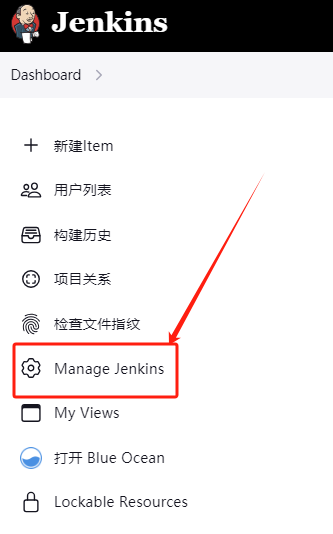
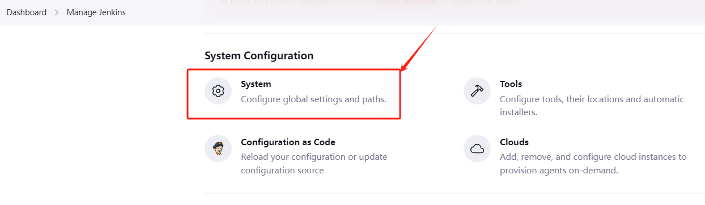
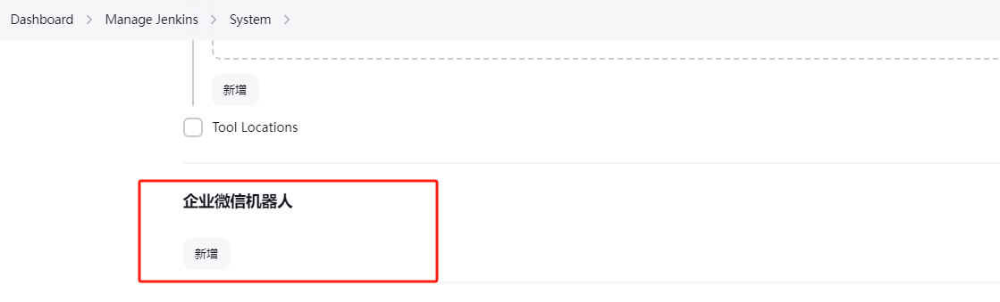
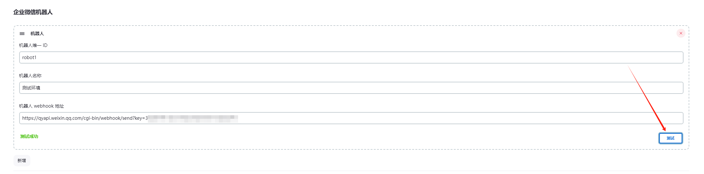
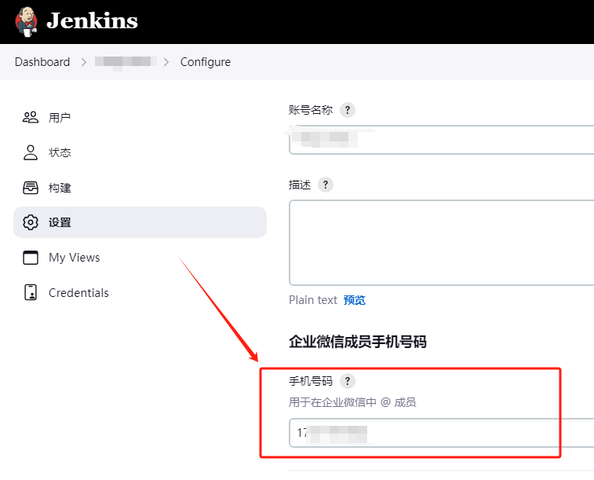

# 企业微信机器人配置

### 一、配置企业微信机器人

需要在 jenkins 系统配置中配置企业微信机器人，支持配置多个机器人

- 1、点击`全局设置`

- 2、进入`系统设置`

- 3、下拉找到`企业微信机器人`，点击`新增`

- 4、添加机器人信息并测试

- 5、保存配置即可

### 二、配置企业微信成员的手机号信息

需要在 jenkins 用户信息页面，配置企业微信成员手机号码，这样 jenkins 才知道当前 job 的执行结果应该 @ 那个企业微信中成员

- 进入用户账号设置，配置手机号，这个手机号是用户在企业微信中成员的手机号

